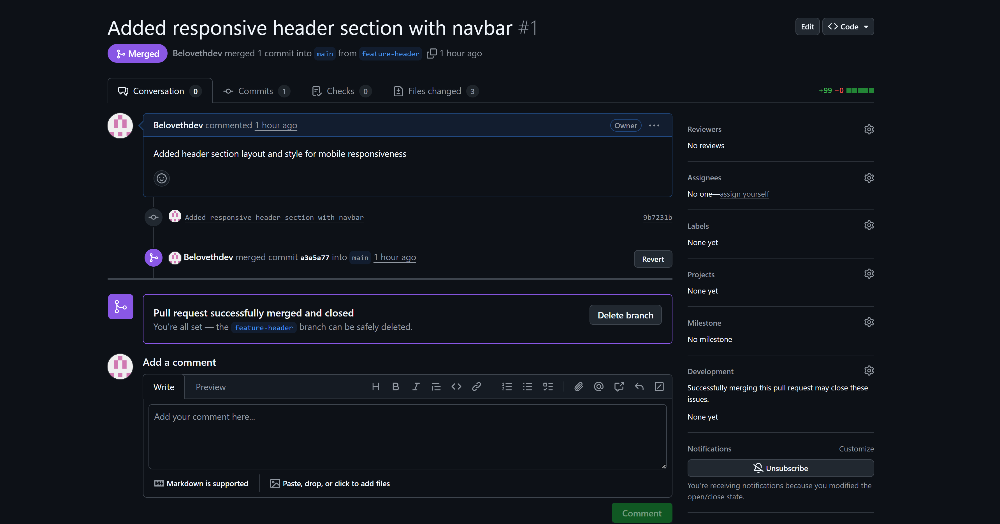
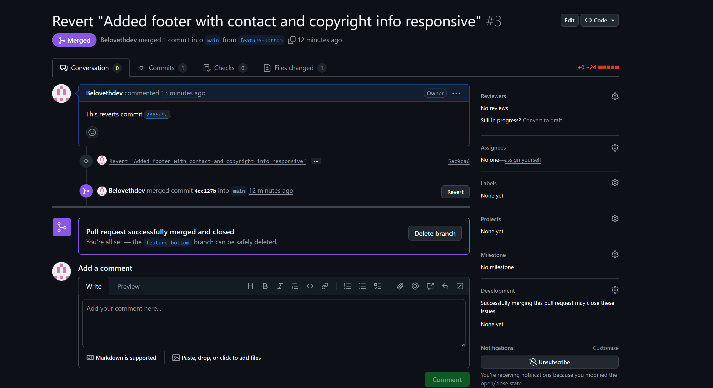

# Frontend Version Control Task – Oluwagbemiga

## 🧠 Project Overview
A simple “BeSmart Demo” webpage demonstrating version control using Git and GitHub.

## 🔧 Branches
- `feature-header`: Added navbar and hero layout.
- `feature-footer`: Built responsive footer section.

## 🔁 Git Commands Used
- `git init`, `git add .`, `git commit -m ""`
- `git checkout -b branchname`
- `git push origin branchname`
- `git merge`, `git revert`, `git branch -m`

## 📸 Screenshots

### Merged Header Feature

### Merged Footer Feature

## 💡 Lessons Learned
- Importance of branching before new features  
- Clear commit messages make history readable  
- Pull requests make collaboration easy  
- Reverting is safer than deleting commits
